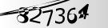

# CNN-Captcha-Solver
Solving Complex Captchas using Convolution Neural Network


### Install

This project requires **Python** and the following Python libraries installed:

- [NumPy](https://www.numpy.org/)
- [Pandas](https://pandas.pydata.org/)
- [matplotlib](https://matplotlib.org/)
- [Keras](https://keras.io/)
- [Tensorflow](https://www.tensorflow.org/install/pip)
- [Jupyter Notebook](https://ipython.org/notebook.html)

If you do not have Python installed yet, it is highly recommended that you install the [Anaconda](https://www.anaconda.com/download/) distribution of Python, which already has most of the above packages and more included or if you don't want to install a huge number of packages then you can try [Miniconda](https://conda.io/miniconda.html) and then install the above packages.

### Code

Code is in the [CNN-Captcha-Solver.ipynb](CNN-Captcha-Solver.ipynb) notebook file.

### Run

In a terminal or command window, navigate to the top-level project directory `CNN-Captcha-Solver/` (that contains this README) and run one of the following commands:

```bash
jupyter notebook CNN-Captcha-Solver.ipynb
```

or

```bash
ipython notebook CNN-Captcha-Solver.ipynb
```

This will open the Jupyter Notebook software and project file in your browser.


### Data
The dataset used in this project can be found in set4 folder.

### Project Structure

Whole case study is implemented using machine learning template which contains 6 steps as follows

1. Prepare Problem
`a) Load libraries`
`b) Load dataset`

2. Summarize Data
`a) Descriptive statistics`
`b) Data visualizations`


4. Create Model
`a) create Model`
`b) train and save model`

5. Improve Accuracy
`a) Algorithm Tuning`

6. Finalize Model
`a) Predictions on validation dataset`
`b) Create standalone model on entire training dataset`
`c) Save model for later use`



